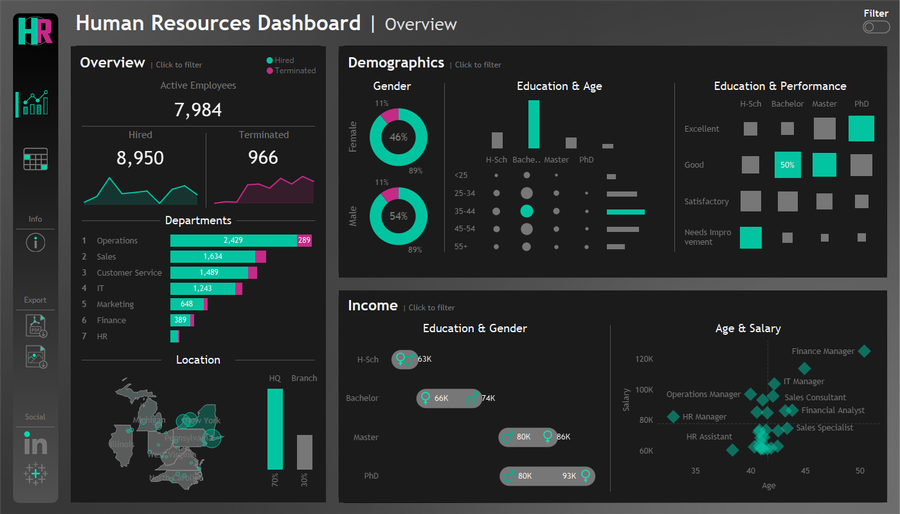
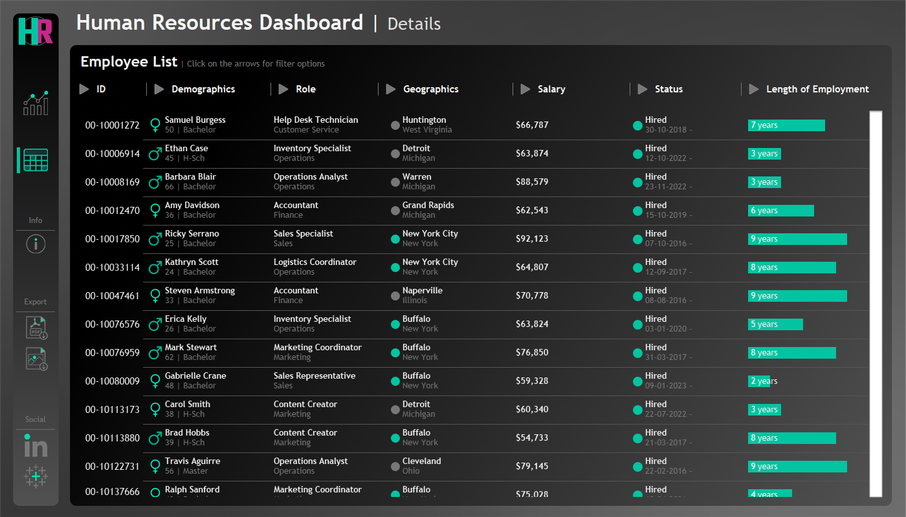

# Data Visualization - HR Dashboard Project

This project consists of two interactive dashboards designed to deliver comprehensive data visualization and analysis. The first, HR Summary Dashboard, focuses on high-level insights (Part 1), while the second, HR Details Dashboard, provides detailed employee records for in-depth analysis (Part 2).

Developed using Tableau, the dashboards are structured around detailed user stories that define key requirements and functionalities. The objective is to support stakeholders including HR managers and executives, in making informed, data-driven decisions by offering clear insights. They also help analyze human resources data by providing both summary views for high-level insights and detailed employee records for in-depth analysis.


*Image Credit: dataterrain.com*

# HR Summary Dashboard | Requirements | Part 1

## Summary View

The summary view should be divided into three main sections: Overview, Demographics, and Income Analysis.

### Overview

The Overview section should provide a snapshot of the overall HR metrics, including:

 - Display the total number of hired employees, active employees, and terminated employees.
 - Visualize the total number of hired and terminated employees over the years.
 - Present a breakdown of total employees by department and job titles.
 - Compare total employees between headquarters (HQ) and branches (New York is the HQ).
 - Show the distribution of employees by city and state.

### Demographics

The Demographics section should offer insights into the composition of the workforce, including:

 - Present the gender ratio in the company.
 - Visualize the distribution of employees across age groups and education levels.
 - Show the total number of employees within each age group.
 - Show the total number of employees within each education level.
 - Present the correlation between employees’s educational backgrounds and their performance ratings.

### Income

The income analysis section should focus on salary-related metrics, including:

 - Compare salaries across different education levels for both genders to identify any discrepancies or patterns.
 - Present how the age correlate with the salary for employees in each department.

# HR Details Dashboard | Requirements | Part 2

## Details View

The details view should display all relevant information about each employee.

### Employee Records

 - Provide a comprehensive list of all employees with necessary information such as name, department, position, gender, age, education, and salary.
 - Users should be able to filter the list based on any of the available columns.

# Live Dashboards | Part 1 & Part 2

Check out the **HR Summary (Part 1)** on Tableau Public using the link provided below:

## [HR Summary Dashboard Link](https://public.tableau.com/views/HRDashboard_17447943665590/HRSummary)

Check out the screenshot of  **HR Summary Dashboard (Part 1)** below:


Check out the **HR Details Dashboard (Part 2)** on Tableau Public using the link provided below:

## [HR Details Dashboard Link](https://public.tableau.com/views/HRDashboard_17447943665590/HRDetails)

Check out the screenshot of  **HR Details Dashboard (Part 2)** below:


## Repository Structure
```
Data-Visualization-HR/
│
├── Dashboard Icons/                    # Icons used in the interactive dasboards for the project
│
├── Datasets/                           # Raw datasets used for the project
│
├── Images/                             # Dashboards Screenshots and Images
│   ├── data_visualization_image.png    # Image of data visualization
│   ├── hr_summary_dashboard_image.png  # Static Screenshot of HR Summary Dashboard
│   └── hr_details_dashboard_image.png  # Static Screenshot of HR Details Dashboard
│
└── README.md                           # Project overview and instructions
```

## Source of Inspiration

This project draws ideas, datasets or structures from the project featured on Youtube channel - Data with Baraa.
